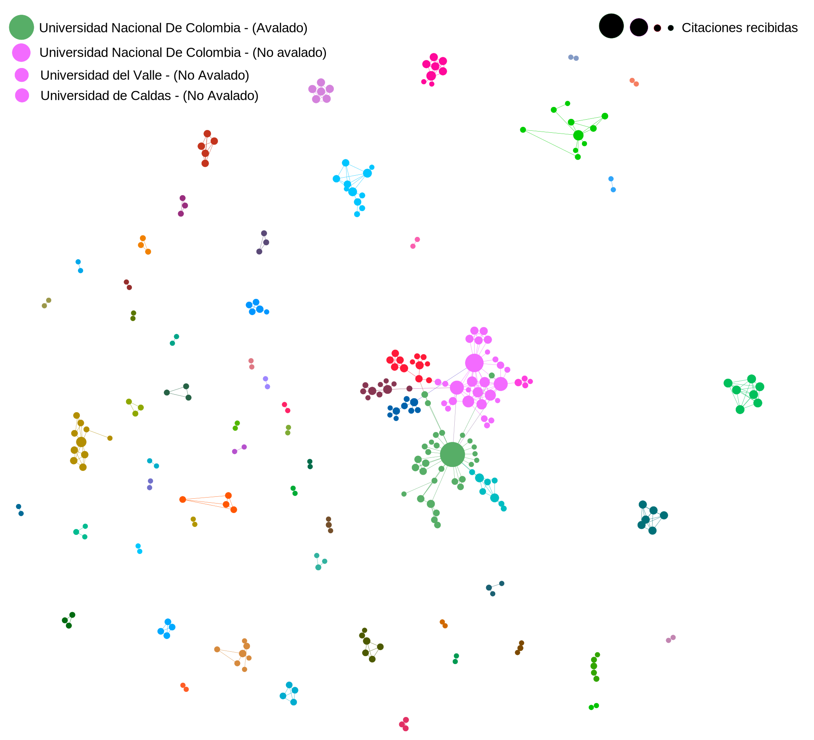

```{r setup, include=FALSE}
knitr::opts_chunk$set(echo = TRUE)
```

```{r echo=FALSE, message=FALSE, warning=FALSE, cache=FALSE}
library(tidyverse)
library(tidymodels)
library(tidygraph)
library(igraph)
library(DT)
library(visNetwork)
library(ggraph)
library(rcrossref)
library(purrr)
library(vip)
library(lubridate)
library(yardstick)
library(psych)
library(bestNormalize)
library(performance)
library(report)
library(plotly)
library(nortest)
library(here)
library(readr)
```

```{r message=FALSE, warning=FALSE, echo=FALSE}
grupos <- read_csv(here("data", "grupos_general_merged.csv")) |> 
  select(grupo, Nombre_grupo, Linea_investigacion, Instituciones) |>  
  rename(nombre_grupo = Nombre_grupo, linea_investigacion = Linea_investigacion, instituciones = Instituciones)

papers <- 
  read_csv("https://docs.google.com/spreadsheets/d/1OFg9Jzypg_uwsmFxyXFSgtdfXfgsN9AG/export?format=csv&gid=808772593") |> 
  filter(ano > 2014) 

researchers <- 
  read_csv("https://docs.google.com/spreadsheets/d/1mpwR15wHbrFbO1s8DWsDdLta_aou7gHD/export?format=csv&gid=2102359855") |> 
  mutate(universidad = "bios")

papers <- merge(papers, grupos,
                 by = c("grupo")) 

researchers <- researchers |> 
  separate_rows(grupo, sep = "; ") |> 
  mutate(grupo = as.integer(grupo)) |> 
   left_join(grupos |> select(grupo, nombre_grupo, instituciones),
                     by = c("grupo")) |> 
  group_by(integrantes,
           vinculacion,
           horas_dedicacion,
           url,
           inicio_vinculacion,
           fin_vinculacion,
           posgrade,
           clasification,
           articulos,
           capitulos,
           libros,
           softwares,
           innovaciones,
           trabajos_dirigidos,
           universidad) |> 
  mutate(grupo = paste0(grupo,
                        collapse = "; "),
         nombre_grupo = paste0(nombre_grupo,
                               collapse = "; "),
         instituciones = paste0(instituciones,
                              collapse = "; ")) |> 
  unique()
```

# Análisis descriptivo

## Investigadores en internos y externos

```{r, echo=FALSE, warning=FALSE, message=FALSE, cache=FALSE}
authors_others <-
  papers |>
  select(id, autores, ano) |>
  separate_rows(autores, sep = ", ") |>
  group_by(id) |>
  filter(n() > 1) |>
  left_join(researchers |>
              select(integrantes, universidad, nombre_grupo),
            by = c("autores" = "integrantes")) |>
  mutate(universidad = if_else(is.na(universidad), "Otra", universidad),
         grupo = if_else(is.na(nombre_grupo), "Externo", nombre_grupo)) |>
  ungroup() |>
  select(-id, -nombre_grupo) |>
  group_by(ano) |>
  count(universidad, name = "otra") |>
  mutate(universidad = paste0(otra, collapse = ",")) |>
  select(ano, universidad) |>
  unique() |>
  separate(universidad, into = c("universidad", "otra"), sep = ",") |>
  ungroup() |>
  transform(ano = as.character(ano),
            universidad = as.numeric(universidad),
            otra = as.numeric(otra))

fig <- plot_ly(authors_others, x = ~ano,y = ~otra, type = 'bar',
               name ="Investigador externo") |>
  add_trace(y = ~universidad, name="Investigador grupos BIOS") |>
  layout(xaxis = list(title="Año"),
  yaxis = list(title='Investigadores'), barmode = 'group')
fig
```

## Calidad de producción anual

```{r, echo=FALSE, warning=FALSE, message=FALSE, cache=FALSE}
papers |> 
  select(ano, SJR_Q) |> 
  group_by(ano, SJR_Q) |> 
  count() |> 
  filter(SJR_Q != "-",
         SJR_Q != "Sin categoria") |> 
  arrange(ano) |> 
  rename(total = n) |> 
  ggplot(aes(x = factor(ano), y = total, fill = SJR_Q)) +
  geom_bar(stat = "identity", 
           position = "dodge") +
  geom_text(aes(label = total), 
            vjust = 1.5,
            position = position_dodge(.9)) +
  theme_bw()
```

# Red Social Académica

Creamos la red social y revisamos sus características

```{r, echo=FALSE, warning=FALSE, message=FALSE, cache=FALSE}
authors_sep <-  
  papers |> 
  select(id, autores) |> 
  separate_rows(autores, sep = ", ")
```

```{r, echo=FALSE, warning=FALSE, message=FALSE, cache=FALSE}
authors_graph_tbl <- 
  papers |> 
  select(id, autores) |> 
  separate_rows(autores, sep = ", ") |> 
  group_by(id) |> 
  filter(n() > 1) |> 
  expand(from = autores, to = autores) |> 
  filter(from != to) |> 
  ungroup() |> 
  select(-id) |> 
  graph_from_data_frame(directed = FALSE) |> 
  as_tbl_graph() |> 
  convert(to_simple) |> 
  activate(nodes) |> 
  left_join(researchers |> 
              dplyr::select(integrantes, universidad, nombre_grupo), 
            by = c("name" = "integrantes")) |>
  mutate(universidad = if_else(is.na(universidad), "otra", universidad),
         grupo = if_else(is.na(nombre_grupo), "Externo", nombre_grupo),
         components = group_components(type = "weak")) |> 
  filter(components == 1)

universidad_graph_tbl <- 
  papers |> 
  select(id, instituciones) |> 
  separate_rows(instituciones, sep = ", ") |> 
  group_by(id) |> 
  filter(n() > 1) |> 
  expand(from = instituciones, to = instituciones) |> 
  filter(from != to) |> 
  ungroup() |> 
  select(-id) |> 
  graph_from_data_frame(directed = FALSE) |> 
  as_tbl_graph() |> 
  convert(to_simple) |> 
  activate(nodes) 
```

```{r, echo=FALSE, warning=FALSE, message=FALSE, cache=FALSE}
nodes <- 
  authors_graph_tbl |> 
  activate(nodes) |>
  mutate(community=as.character(group_louvain())) |>
  mutate(id = row_number()) |> 
  data.frame() |> 
  rename(label = name) |> 
  select(id, label, universidad, nombre_grupo, community)


edges <- 
  authors_graph_tbl |> 
  activate(edges) |> 
  as_tibble()

# graph_from_data_frame(d = edges, 
#                       directed = FALSE, 
#                       vertices = nodes) |>
#   write_graph("output/academic_social_network.graphml",
#               "graphml")

```

```{r, echo=FALSE, warning=FALSE, message=FALSE, cache=FALSE}
nodes_u <- 
  universidad_graph_tbl |> 
  activate(nodes) |>
  mutate(community=as.character(group_louvain())) |>
  mutate(id = row_number()) |> 
  data.frame() |> 
  rename(label = name) |> 
  select(id, label, community) 

edges_u <- 
  universidad_graph_tbl |> 
  activate(edges) |> 
  data.frame() |> 
  select(from, to) 

# graph_from_data_frame(d = edges_u,
#                       directed = FALSE,
#                       vertices = nodes_u) |>
#   write_graph("output/academic_social_network_instituciones.graphml",
#               "graphml")
```

## Colaboración científica entre instituciones

Visualización de la red social académica entre las instituciones de los grupos BIOS.

Buscamos las instituciones más populares de acuerdo a la cantidad de conexiones que han generado.



```{r, echo=FALSE, warning=FALSE, message=FALSE, cache=FALSE}
universidad_graph_tbl|> 
  activate(nodes) |> 
  mutate(degree = centrality_degree(), 
         betweenness = round(centrality_betweenness(), 
                             digits = 2)) |>
  arrange(desc(degree)) |> 
  data.frame() |> 
  select("Institucion" = name,
         Grado = degree,
         "Intermediación" = betweenness) |>
  DT::datatable(class = "cell-border stripe", 
                rownames = F, 
                filter = "top", 
                editable = FALSE, 
                extensions = "Buttons", 
                options = list(dom = "Bfrtip",
                               buttons = c("copy",
                                           "csv",
                                           "excel", 
                                           "pdf", 
                                           "print")))
```

## Colaboración científica entre autores

Visualización de la red social académica entre los investigadores de los grupos BIOS.

Buscamos los investigadores más populares de acuerdo a la cantidad de conexiones que han generado.


```{r}
#Principales nodos
autores <- 
  authors_graph_tbl |> 
  activate(nodes) |>
  mutate(community=as.character(group_louvain())) |> 
  mutate(degree = centrality_degree())

autores |> 
  ggraph(layout = "graphopt") +
  geom_edge_link(width = 1, 
                 colour = "lightgray") +
  geom_node_point(aes(color = community, 
                      size = degree)) +
  geom_node_text(aes(label = name), repel = TRUE) +
  theme_graph()
```

```{r, echo=FALSE, warning=FALSE, message=FALSE, cache=FALSE}
authors_graph_tbl |> 
  activate(nodes) |> 
  mutate(degree = centrality_degree(), 
         betweenness = round(centrality_betweenness(), 
                             digits = 2)) |>
  arrange(desc(degree)) |> 
  data.frame() |> 
  select(Investigador = name,
         grupo,
         Grado = degree,
         "Intermediación" = betweenness,
         Cluster = components) |>
  DT::datatable(class = "cell-border stripe", 
                rownames = F, 
                filter = "top", 
                editable = FALSE, 
                extensions = "Buttons", 
                options = list(dom = "Bfrtip",
                               buttons = c("copy",
                                           "csv",
                                           "excel", 
                                           "pdf", 
                                           "print")))
```

# Investigadores más productivos

Estos análisis se sitúan entre 2016 y 2021. Queremos ver la calidad

```{r, echo=FALSE, warning=FALSE, message=FALSE, cache=FALSE}
grupo <- grupos |> 
  select(grupo, nombre_grupo, instituciones)

researchers_1 <- researchers |> 
  select(integrantes, grupo) |> 
  separate_rows(grupo, sep = "; ") |> 
  mutate(grupo = as.numeric(grupo)) |> 
  left_join(grupo) |> 
  select(-universidad) |> 
  mutate(universidad = instituciones) |> 
  select(-instituciones)

papers_1 <- # We need to split autores from papers
  papers |> 
  select(grupo,
         nombre_grupo,
         instituciones,
         categoria_revista, 
         SJR_Q , 
         ano, 
         autores) |> 
  mutate(universidad = instituciones) |> 
  select(-instituciones) |> 
  separate_rows(autores, sep = ", ") |>  # Separate researchers 
  select(grupo,
         nombre_grupo,
         universidad,
         integrantes = autores, 
         ano, 
         categoria_revista, 
         SJR_Q)

paper_publindex <- 
  researchers_1 |> 
  left_join(papers_1, by = c("integrantes" = "integrantes", 
                             "nombre_grupo" = "nombre_grupo",
                             "universidad" = "universidad")) |> 
  select(integrantes,
         nombre_grupo,
         universidad,
         ano, 
         categoria_revista) |> 
  group_by(integrantes,
           nombre_grupo,
           universidad,
           ano) |> 
  count(categoria_revista) |> 
  pivot_wider(names_from = categoria_revista, 
              values_from = n) |> 
  replace_na(list(A1 = 0, 
                  A2 = 0, 
                  C = 0, 
                  "Sin categoria" = 0, 
                  B = 0)) |> 
  select(integrantes, nombre_grupo, universidad, ano, A1, A2, B, C, "Sin categoria") |> 
  arrange(desc(A1))

paper_scimago <- 
  researchers_1 |> 
  left_join(papers_1, by = c("integrantes" = "integrantes", 
                             "nombre_grupo" = "nombre_grupo",
                             "universidad" = "universidad")) |> 
  select(integrantes,
         nombre_grupo,
         universidad,
         ano, 
         SJR_Q) |> 
  group_by(integrantes,
           nombre_grupo,
           universidad,
           ano) |> 
  count(SJR_Q) |>
  na.omit() |> 
  pivot_wider(names_from = SJR_Q, 
              values_from = n) |> 
  replace_na(list(Q1 = 0, 
                  Q2 = 0, 
                  Q3 = 0, 
                  "Sin categoria" = 0, 
                  Q4 = 0)) |> 
  select(integrantes, nombre_grupo, universidad, ano, Q1, Q2, Q3, Q4, "Sin categoria") |> 
  arrange(desc(Q1))
```

## Producción general

Producción top de los 10 mejores investigadores

```{r, echo=FALSE, warning=FALSE, message=FALSE, cache=FALSE}
q1_top <- 
  paper_scimago |> 
  filter(ano >= 2016) |> 
  group_by(integrantes, nombre_grupo, universidad) |> 
  summarise(Q1_total = sum(Q1)) |> 
  filter(Q1_total != 0) |> 
  arrange(desc(Q1_total))

q2_top <- 
  paper_scimago |> 
  filter(ano >= 2016) |> 
  group_by(integrantes) |> 
  summarise(Q2_total = sum(Q2)) |> 
  filter(Q2_total != 0) |> 
  arrange(desc(Q2_total))

a1_top <- 
  paper_publindex |> 
  filter(ano >= 1016) |> 
  group_by(integrantes) |> 
  summarise(A1_total = sum(A1)) |> 
  filter(A1_total != 0) |> 
  arrange(desc(A1_total))

a2_top <- 
  paper_publindex |> 
  filter(ano >= 2016) |> 
  group_by(integrantes) |> 
  summarise(A2_total = sum(A2)) |> 
  filter(A2_total != 0) |> 
  arrange(desc(A2_total))

# Merging all datasets

top_researchers <- 
  q1_top |> 
  left_join(q2_top, by = "integrantes") |> 
  left_join(a1_top, by = "integrantes") |> 
  left_join(a2_top, by = "integrantes") |> 
  rename(Q1 = Q1_total,
         Q2 = Q2_total,
         A1 = A1_total,
         A2 = A2_total) |> 
  replace_na(replace = list(Q1 = 0,
                            Q2 = 0,
                            A1 = 0,
                            A2 = 0))

top_researchers |> 
  DT::datatable(class = "cell-border stripe", 
                rownames = F, 
                filter = "top", 
                editable = FALSE, 
                extensions = "Buttons", 
                options = list(dom = "Bfrtip",
                               buttons = c("copy",
                                           "csv",
                                           "excel", 
                                           "pdf", 
                                           "print")))

```

## Publindex producción

```{r, echo=FALSE, warning=FALSE, message=FALSE, cache=FALSE}
paper_publindex |> 
  DT::datatable(class = "cell-border stripe", 
                rownames = F, 
                filter = "top", 
                editable = FALSE, 
                extensions = "Buttons", 
                options = list(dom = "Bfrtip",
                               buttons = c("copy",
                                           "csv",
                                           "excel", 
                                           "pdf", 
                                           "print")))
```

## Scimago producción

Tabla

```{r, echo=FALSE, warning=FALSE, message=FALSE, cache=FALSE}
paper_scimago |> 
  DT::datatable(class = "cell-border stripe", 
                rownames = F, 
                filter = "top", 
                editable = FALSE, 
                extensions = "Buttons", 
                options = list(dom = "Bfrtip",
                               buttons = c("copy",
                                           "csv",
                                           "excel", 
                                           "pdf", 
                                           "print")))
```
